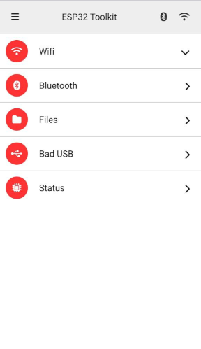

# ESP32-TOOLKIT

A toolset for ethical hacking on the ESP32

## Features

- 📡 WiFi
    - 📡 Scan
    - 📡 Deauth
    - 📡 Beacon SPAM
- 🔵 Bluetooth
    - 🔵 BLE Spam
- 💀 Bad USB
- 📁 File Manager
- ⚙️ Status

## Screenshots

